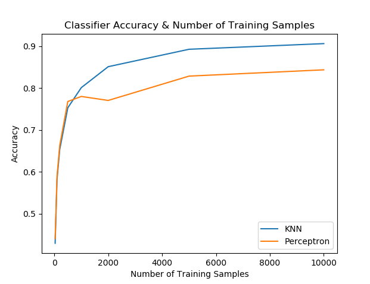
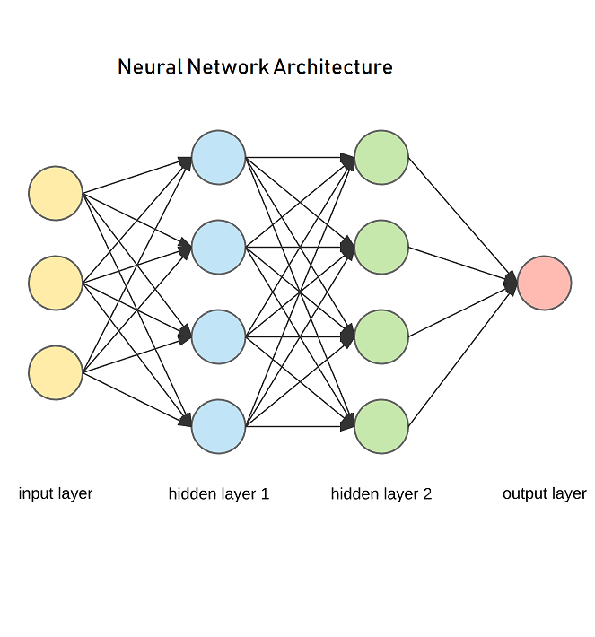
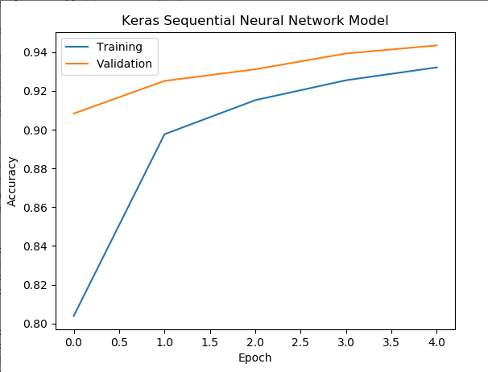

# cebd1160: Digital Image Handwriting Recognition
Instructions for final projects.

| Name | Date |
|:-------|:---------------|
|Jun Liu | 2019.11.18|

-----

### Resources
Your repository should include the following:

- Python script for your analysis: ./*.py
- Results: ./figures/*.png
- Dockerfile for your experiment
- runtime-instructions in a file named RUNME.md

-----

## Research Question

How to solve handwriting digits recognition problem using machine learning algorithms?
 
### Abstract
The problem we need to solve is to classify handwritten digits. The goal is to take an image of a handwritten digit and determine what that digit is. The digits range from 0 through 9. We could apply machine learning algorithms to solve our problem. Using simple handwriting digit datasets provided by Scikit-learn, we achieved from 97% F1-score with Nearest Neighbor (KNN) classifier, to achieving 99% F1 score with Support Vector Classifier(SVC). The scope of this article also include comparing the different classifiers, using dataset from the famous MNIST (Modified National Institute of Standards and Technology), and try to achieve higher performance by choosing parameters along with dataset preprocessing technique.
### Introduction
When use public digit dataset provided from scikit-learn, the data that we are interested in is made of 8x8 image, it contains 1797 samples, 64 features. Each sample in the dataset represent an image that is 8 pixels in height and 8 pixels in width, the total of 64 pixels. Each image is labelled with their corresponding category that is the actual digit from 0 to 9 for a total of 10 different type of labels. Using these data, we could find out the relationships between image pixels and their digit values, which can then be used for predicting the target digit. Scikit-learn machine learning algorithms, Support Vector Machines (SVMs), Nearest Neighbor (NN) techniques and Perceptron are used in our solution.

We also use MNIST training set, which is much more larger compair to Scikit-learn training Digits set, it contains 42,000 samples in total and 784 features. Each sample in the dataset represent an image that is 28 pixels in height and 28 pixels in width, hence the total of 784 pixels. Same as Scikit-learn,  each image is labelled with their corresponding category that is the actual digit from 0 to 9. Keras Sequential Neural Networks algorithm is used for this training set.

### Methods Using Scikit-learn
For Scikit-learn training set, we use Support Vector Machines (SVMs) Nearest Neighbor (NN) and Perceptron techniques to solve the problem. The tasks involved are the following:

1. Load and Explore the Digit Dataset (Scikit-learn recommended ways to load datasets)
2. Simple visualization and classification of the digits dataset (Picture 1)
3. Dataset Preprocessing 
4. Train a classifier, apply the model on the test set and report its accuracy

#### 1. Load and Explore the Dataset

#### 2. Simple visualization and classification of the digits dataset

#### 3. Dataset preprocessing
I give a example for data preprocessing when use Nearest Neighbor (KNN) classifier.

The accuracy of KNN can be severely degraded with high-dimension data because there is little difference between the nearest and farthest neighbor. Dimensionality reduction techniques like PCA could be executed prior to appplying KNN and help make the distance metric more meaningful.

Since the original dimension is quite large (784 input features), the dimensionality reduction becomes necessary. First, we extract the principal components from the original data. We do this by fitting a Principle Component Analysis (PCA) on the training set, then transforming the data using the PCA fit. We used the PCA module of the scikit-learn Python library with n_components set to differenct value to transform the dataset. From the test result, I found the first 30 ~ 60 principal components can interpret approximately 90% of total information, which suffice to be representative of the information in the original dataset. We thus choose the first 60 principal components as the extracted features.

#### 4. Result
 Table showing difference algorithms perform on the Scikit-learn hand-written digits dataset.

### Methods Using Keras Sequential Neural Networks

### Discussion
The methods used here did solved the problem of identifying handwritten digits. This method shows that using the current online training dataset, SVC has the best performance, KNN has rated as second high score. While Perceptron designed for large scale dataset, it looks not as good as SVC or KNN when using the small dataset.   
Handwritted digits are store as image file, the size may changes in real life, the digit may rotate in different direction, all these issues are not tested because of the our dataset limit.  
### References
Dataset: https://scikit-learn.org/stable/modules/generated/sklearn.datasets.load_digits.html#sklearn.datasets.load_digits
Sklearn: https://scikit-learn.org/stable/whats_new.html#version-0-21-3
Seaborn: https://seaborn.pydata.org/index.html
Matplotlib3.1.1: matplotlib.org/3.1.1/index.html
Handwriting Article reference:
https://medium.com/the-andela-way/applying-machine-learning-to-recognize-handwritten-characters-babcd4b8d705
https://en.wikipedia.org/wiki/Handwriting_recognition
https://scikit-learn.org/stable/auto_examples/linear_model/plot_sgd_comparison.html#sphx-glr-auto-examples-linear-model-plot-sgd-comparison-py

-------
