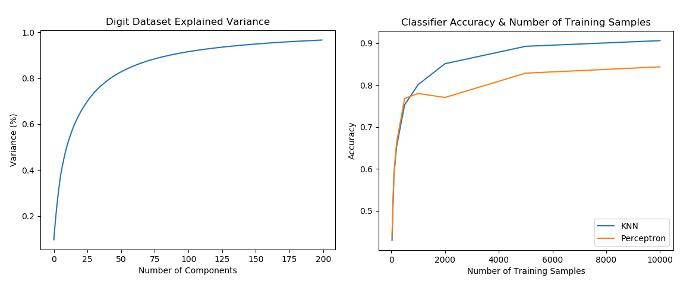

# Digital Image Handwriting Recognition

| Name | Date |
|:-------|:---------------|
|Jun Liu | 2019.11.18|

-----

## Resources
This Project repository includes the following items:

- Python scripts for analysis:  
 [ExploreDigitsDataset](https://github.com/jasonliu2050/project/blob/master/ExploreDigitsDataset.py)  
 [Training sample size & Model Accuracy](https://github.com/jasonliu2050/project/blob/master/TrainingSize_Accuracy.py)  
 [Dataset Preparison](https://github.com/jasonliu2050/project/blob/master/PCA_Linear_dimensionality_reduction.py)  
 [Algorithm Comparison](https://github.com/jasonliu2050/project/blob/master/project.py)  
- Results:  
 [Scores_Use SKlearn dataset](https://github.com/jasonliu2050/project/blob/master/figures/Scores.png)  
 [Scores_Use MNIST_Dataset](https://github.com/jasonliu2050/project/blob/master/figures/FinalScores_MNIST_Dataset.png)
- Dockerfile for your experiment
  [Dockerfile](./Dockerfile)  
- runtime-instructions:
  $python3 project.py
-----

## Research Question

How to solve handwriting digits recognition problem using machine learning algorithms?
 
### Abstract
The problem we need to solve is to classify handwritten digits. The goal is to take an image of a handwritten digit and determine what that digit is. The digits range from 0 through 9. We could apply machine learning algorithms to solve our problem. Using simple handwriting digit datasets provided by Scikit-learn, we achieved from 97% F1-score with Nearest Neighbor (KNN) classifier, to achieving 99% F1 score with Support Vector Classifier(SVC). The scope of this article also include comparing the different classifiers, using dataset from the famous MNIST (Modified National Institute of Standards and Technology), and try to achieve higher performance by choosing parameters along with dataset preprocessing technique.
### Introduction
When use public digit dataset provided from scikit-learn, the data that we are interested in is made of 8x8 image, it contains 1797 samples, 64 features. Each sample in the dataset represent an image that is 8 pixels in height and 8 pixels in width, the total of 64 pixels. Each image is labelled with their corresponding category that is the actual digit from 0 to 9 for a total of 10 different type of labels. Using these data, we could find out the relationships between image pixels and their digit values, which can then be used for predicting the target digit. 

Scikit-learn machine learning algorithms: Support Vector Machines (SVMs), Nearest Neighbor (NN) techniques and Perceptron are used in our solution. For Scikit-learn simple digit dataset, all these algorithms performs very well without doing feature selection or any preprocess for that dataset, for this reason, we also use MNIST training digit dataset, which is much larger compair to Scikit-learn training Digits set. It contains 60,000 samples in total and 784 features. Each sample in the dataset represent an image that is 28 pixels in height and 28 pixels in width, total of 784 pixels. Keras Sequential Neural Networks algorithm is also used for this training set. 

### Methods Using Scikit-learn
For Scikit-learn training set, we use Support Vector Machines (SVMs) Nearest Neighbor (NN) and Perceptron techniques to solve the problem. The tasks involved are the following:

1. Load and Explore the Digit Dataset
2. Simple visualization and classification of the digits dataset
3. Dataset Preprocessing 
4. Train a classifier, and test its accuracy

#### 1. Load and Explore the Dataset
[Test Script: ExploreDigitsDataset](https://github.com/jasonliu2050/project/blob/master/ExploreDigitsDataset.py)  

#### 2. Simple visualization and classification of the digits dataset
This 3D figure shows the classification of targets using Principal component analysis (PCA), 8x8 = 64 pixels (features) reducted to 3 components. This linear dimensionality reduction using Singular Value Decomposition of the data to project it to a lower dimensional space.
[Test Script: ExploreDigitsDataset](https://github.com/jasonliu2050/project/blob/master/ExploreDigitsDataset.py)  

#### 3. Dataset preprocessing
I give a example for data preprocessing when use Nearest Neighbor (KNN) classifier.

The accuracy of KNN can be severely degraded with high-dimension data because there is little difference between the nearest and farthest neighbor. Dimensionality reduction techniques like PCA could be used prior to appplying KNN and help make the distance metric more meaningful.

Since the original dimension is quite large (784 input features), the dimensionality reduction becomes necessary. First, we extract the principal components from the original data. We do this by fitting a Principle Component Analysis (PCA) on the training set, then transforming the data using the PCA fit. We used the PCA module of the scikit-learn Python library with n_components set to differenct value to transform the dataset(use pca.explained_variance_ratio_). From the test result, I found 70 principal components can interpret approximately 90% of total information, which suffice to be representative of the information in the original dataset. We choose the first 70 principal components as the extracted features. The test result shows Accuracy and performance (fast) are much better than use all input features. ([Test Script: PCA Linear Dimensionality Reduction](https://github.com/jasonliu2050/project/blob/master/PCA_Linear_dimensionality_reduction.py))  

The following picture also show Training data size are very important to the final test accuracy result.  
([Test Script: Training sample size & Model Accuracy](https://github.com/jasonliu2050/project/blob/master/TrainingSize_Accuracy.py)) 

### 4. Final Test Result
#### Methods Using Scikit-learn Algorithms
Picture below shows different algorithm performance. The test script use the best fit parameter we found during the dataset preprocessing. We use 100 (n_components) for PCA Linear dimensionlity Reduction. Use 10,000 sample for training dataset, all test results are good using large MNIST digit dataset.  
#### Methods Using Keras Sequential Neural Networks
Keras Neural Networks are very diferent from Scikit-learn, we use 1024 nodes for the first layer(input), use 10 Epoch. Here we can see the test result, without doing any optimazition, Keras Neural Network algorithm easily reach 0.95 accuracy using MNIST digit dataset, much better than Scikit-learn algorithms when use the same test dataset.  
[Project Script: Algorithm Comparison](https://github.com/jasonliu2050/project/blob/master/project.py)  

## Discussion
The methods used above did solved the problem of identifying handwritten digits. These methods shows that using the current online training dataset, all  Scikit-learn algorithms: SVC, KNN, Perceptron performs very good when using the small dataset, Keras Neural Network algorithm has the best performance when using MNIST training digit dataset.  
We still need to test these algorithms performance use digit images in real life, for example, imges size may change, it may rotate in different direction, and how to handle digital image samples in dark backgroud etc. All these new issues need use Computer Vision and Pattern Recognition algorithm.(eg, OpenCV).   

## References
[Dataset](https://scikit-learn.org/stable/modules/generated/sklearn.datasets.load_digits.html#sklearn.datasets.load_digits)  
[Scikit-learn](https://scikit-learn.org/stable/whats_new.html#version-0-21-3) 
[Scikit-kearn Classifier comparison](https://scikit-learn.org/stable/auto_examples/classification/plot_classifier_comparison.html)  
[Keras Example](https://medium.com/tebs-lab/how-to-classify-mnist-digits-with-different-neural-network-architectures-39c75a0f03e3)  
[Keras Sequential model](https://keras.io/models/sequential/)  
[Matplotlib3.1.1](https://matplotlib.org/3.1.1/users/whats_new.html)  
[Handwriting Article reference](https://medium.com/the-andela-way/applying-machine-learning-to-recognize-handwritten-characters-babcd4b8d705)   
[Principal component analysis (PCA)](https://scikit-learn.org/stable/modules/generated/sklearn.decomposition.PCA.html)
