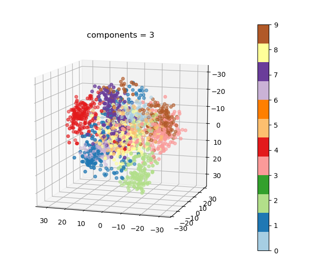

# cebd1160: Digital Image Handwriting recognition
Instructions for final projects.

| Name | Date |
|:-------|:---------------|
|Jun Liu | 2019.11.18|

-----

### Resources
Your repository should include the following:

- Python script for your analysis: project.py
- Results: figures/*.png
- Dockerfile for your experiment
- runtime-instructions in a file named RUNME.md

-----

## Research Question

How can we recognise digit in handwriting image using machine learning algorithm? 
### Abstract
The problem we need to solve is to classify handwritten digits. The goal is to take an image of a handwritten digit and determine what that digit is. The digits range from 0 through 9. By using handwriting digit dataset provided from Sklearn, we could apply machine learning algorithm to solve the problem, with different classifiers and parameters along with preprocessing techniques, we achieved from 0.97 F1-score with Nearest Neighbor (NN) classifier to achieving 0.99 Support Vector Classifier(SVC). The scope of this article also include comparing the different classifiers with different parameters and try to achieve higher performance.

### Introduction
We use public digit dataset provided from Sklearn, the data that we are interested in is made of 8x8 images of digits (deep 4bits), it contains 1797 samples, 64 features. Each sample in the dataset represent an image that is 8 pixels in height and 8 pixels in width, the total of 64 pixels. Each image is labelled with their corresponding category that is the actual digit from 0 to 9 for a total of 10 different type of labels. Using these data, we could find out the relationships between image pixels and their digit values, which can then be used for predicting the target digit. Sklearn machine learning algorithm Support Vector Machines (SVMs) and Nearest Neighbor (NN) techniques are used in our solution.

### Methods
We use Support Vector Machines (SVMs) and Nearest Neighbor (NN) techniques to solve the problem. The tasks involved are the following:

1. Load Digit Dataset (sklearn recommended ways to load datasets)
2. Simple visualization and classification of the digits dataset (Picture 1)
3. To apply a classifier on this data, we can flat the image, to turn the data in a (samples, feature) matrix or directly use the data.
4. Train a classifier that can categorize the handwritten digits
5. Apply the model on the test set and report its accuracy

Based on the preliminary performance of this estimator, we found that both models provide consistent performance. 

Picture 1: Simple visualization and classification of the digits dataset

### Results
Picture 2: 

- At least 1 figure
- At least 1 "value" that summarizes either your data or the "performance" of your method
- A short explanation of both of the above

### Discussion
Brief (no more than 1-2 paragraph) description about what you did. Include:

- interpretation of whether your method "solved" the problem
- suggested next step that could make it better.

### References
Dataset: https://scikit-learn.org/stable/modules/generated/sklearn.datasets.load_digits.html#sklearn.datasets.load_digits
Sklearn: https://scikit-learn.org/stable/whats_new.html#version-0-21-3
Seaborn: https://seaborn.pydata.org/index.html
Matplotlib3.1.1: matplotlib.org/3.1.1/index.html
Handwriting Article reference:
https://medium.com/the-andela-way/applying-machine-learning-to-recognize-handwritten-characters-babcd4b8d705
https://en.wikipedia.org/wiki/Handwriting_recognition

-------
